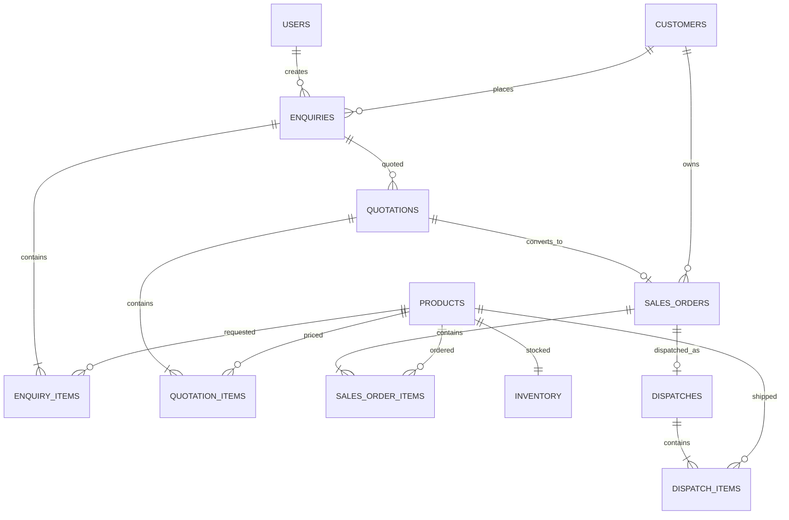

# Fundsroom ERP Case Study

A compact PERN application with an independent React frontend and Express backend for the workflow **Enquiry → Quotation → Sales Order → Reservation → Dispatch**.

```text
frontend/  React + TypeScript + Vite
backend/   Express + PostgreSQL API, schema, seeds, and tests
```

## Stack

- React, TypeScript, Vite
- Node.js, Express, PostgreSQL (`pg`)
- JWT authentication, bcrypt password hashing
- Node's built-in test runner and Supertest

## Local setup

Prerequisites: Node.js 20.19+ (or 22.12+), npm, and PostgreSQL 12+.

1. Create a database named `fundsroom_erp` using pgAdmin or `createdb -U postgres fundsroom_erp`.
2. Apply the schema from the project root:

   ```powershell
   psql -U postgres -d fundsroom_erp -f backend/schema.sql
   ```

3. PostgreSQL may prompt for its password in the terminal. Do not put the password in chat or commit it. Copy `backend/.env.example` to `backend/.env`, set `DATABASE_URL` to the same PostgreSQL username/password (URL-encode special characters in the password), and replace `JWT_SECRET` with a long random value.
4. Install both workspace packages and seed:

   ```powershell
   npm install
   npm run seed
   ```

5. Start the API and frontend in separate terminals:

   ```powershell
   npm run api
   ```

   ```powershell
   npm run dev
   ```

   `npm run api` starts the backend workspace; `npm run dev` starts the React frontend workspace. Open the Vite URL shown in the terminal (normally `http://localhost:5173`).

## Demo credentials

| Role | Email | Password |
| --- | --- | --- |
| Admin | `admin@fundsroom.local` | `Admin@123` |
| Sales | `sales@fundsroom.local` | `Sales@123` |

These are local demo credentials only. Change them before any public deployment.

## Tests and build

```powershell
npm test
npm run build
```

The root scripts delegate to the relevant workspace: tests run in the backend; the build and lint run in the frontend. The automated tests cover backend quotation arithmetic, invalid quotation conversion, duplicate-order prevention, inventory limits, and role authorization.

## Workflow and consistency

- PostgreSQL foreign keys, unique constraints, check constraints, and generated available quantity enforce relational integrity.
- The API calculates every quotation line and total; the browser never supplies an authoritative total.
- Conversion locks the quotation and `sales_orders.quotation_id` is unique, preventing duplicate orders.
- Order confirmation locks inventory rows in product-id order in a transaction, checks available stock, and increments reserved quantity without reducing physical quantity.
- Dispatch locks the order and its inventory, then reduces both physical and reserved quantities in one transaction. One dispatch per sales order prevents duplicate dispatch.
- JWT authentication and role checks are enforced on API routes, not just hidden in the UI.

## Data model



## API quick reference

Send `Authorization: Bearer <token>` for protected routes. Login is `POST /api/auth/login` with `{ "email", "password" }`.

| Method | Endpoint | Role | Purpose |
| --- | --- | --- | --- |
| GET | `/api/products` | Any signed-in user | Product and inventory availability |
| GET, POST | `/api/enquiries` | Any signed-in user / Sales or Admin | List or create enquiries |
| GET, POST | `/api/quotations` | Any signed-in user / Sales or Admin | List or create quotations |
| PATCH | `/api/quotations/:id/status` | Sales or Admin | Move DRAFT→SENT→ACCEPTED/REJECTED |
| POST | `/api/quotations/:id/convert` | Sales or Admin | Convert accepted quotation to order |
| GET | `/api/sales-orders` | Any signed-in user | List orders and their items |
| POST | `/api/sales-orders/:id/confirm` | Admin | Reserve stock and confirm order |
| POST | `/api/sales-orders/:id/dispatch` | Admin | Dispatch a confirmed order |
| PATCH | `/api/inventory/:productId` | Admin | Adjust physical stock without undercutting reservations |

See [API.md](API.md) for request/response examples and workflow error codes.

## Demo recording (under 5 minutes)

1. Sign in as Sales; create an enquiry with two products.
2. Create a quotation, show the calculated total, send it, accept it, and convert it.
3. Sign in as Admin; show available stock, confirm the order, and demonstrate reserved quantity changing.
4. Dispatch it and show physical/reserved/available quantities after dispatch.
5. Briefly show that a Sales account cannot confirm or dispatch an order.

## Git history

Keep the repository rooted at this project folder and record the work as small milestones, for example: `database and seed data`, `authentication and role-protected API`, `quotation and order workflow`, `reservation and dispatch transactions`, `frontend workflow`, and `tests and documentation`. Check `git rev-parse --show-toplevel` before staging so unrelated workspace projects are not included. Do not squash everything into one final commit.
